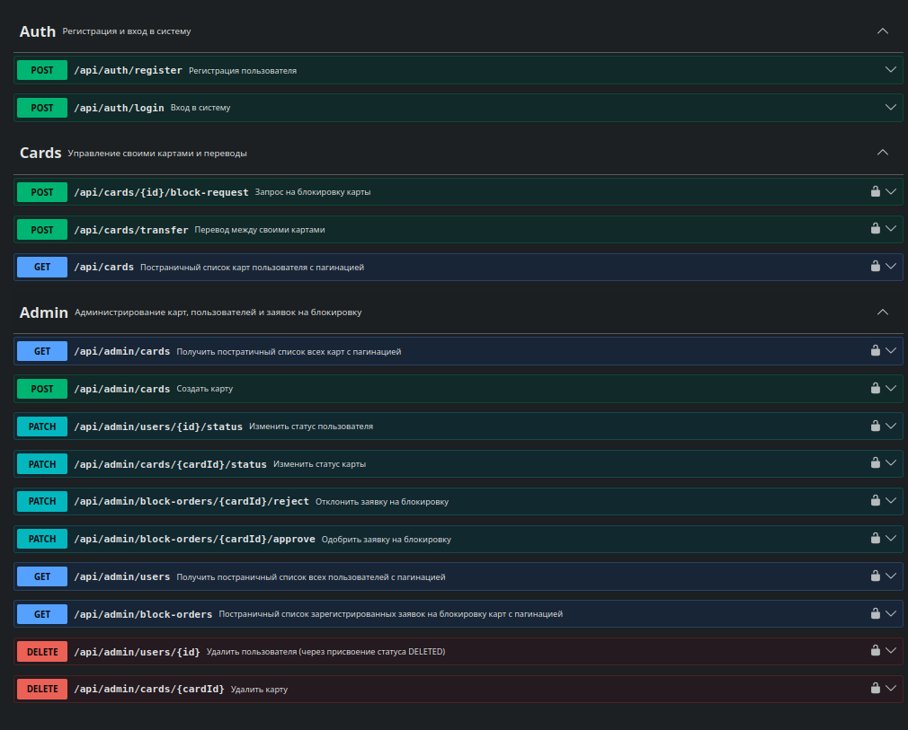
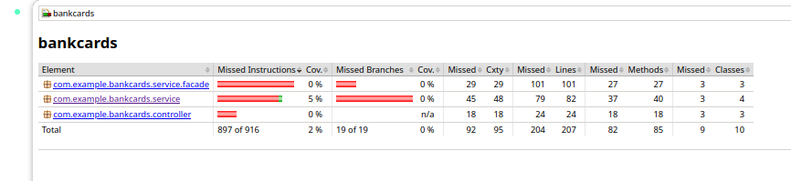

# Bank Cards API

REST API для управления банковскими картами с JWT-аутентификацией и ролевым доступом.

## Технологии

- **Java 17** + **Spring Boot 3.5.13**
- **PostgreSQL 16** + **Liquibase**
- **Spring Security + JWT**
- **Docker Compose**
- **Swagger / OpenAPI 3.1**
- **JaCoCo** — покрытие тестами

## Возможности

**Администратор:**
- Создание, блокировка, активация и удаление карт
- Управление пользователями (просмотр, изменение статуса, удаление)
- Просмотр всех карт
- Одобрение и отклонение заявок на блокировку

**Пользователь:**
- Просмотр своих карт с пагинацией
- Переводы между своими картами
- Запрос на блокировку карты

## Переменные окружения

Заполнить переменные окружения в `.env`, пример: `.env.example`

## API документация

**Swagger UI:** http://localhost:8080/swagger-ui/index.html



## Быстрый старт

```bash
git clone https://github.com/Vldr22/bank-cards.git
cd bank-cards
cp .env.example .env
docker compose -f docker-compose-prod.yml up -d --build
```

## Локальная разработка
> Требуется Maven и Java 17+
```bash
# Поднять контейнер БД PostgreSQL
docker compose -f docker-compose-dev.yml up -d

# Запустить приложение
mvn spring-boot:run
```

## Тестирование
```bash
mvn test
```

